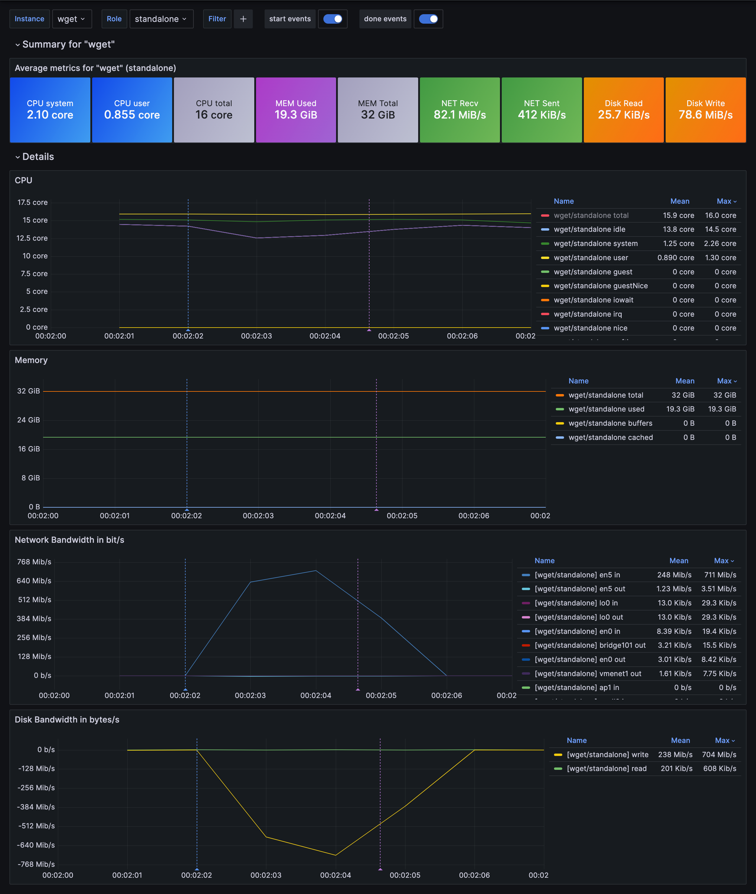

# statexec

`statexec` is a versatile command execution tool written in Go that gathers system metrics during the execution of a specified command. It can operate in various modes, including standalone execution or synchronized start and stop with a server. The tool is perfect for performance monitoring and debugging in different environments.

## Features

- **Multiple Execution Modes:** Supports standalone execution, and client-server start/stop synchronization.
- **Metrics Gathering:** Collects and records detailed system metrics, including CPU, memory, and network usage. 
- **Standard format for metrics:** Metrics are written in a file in [OpenMetrics](https://openmetrics.io/) format (Prometheus compatible).
- **Flexible Configuration:** Customizable through environment variables or flags for tailored usage in different scenarios.

## Usage

The general syntax for using `statexec` is:

```bash
statexec [OPTIONS] <command> [command args]
```

For more detailed usage instructions, use:

```bash
statexec --help
```

## Configuration

`statexec` can be configured via flags or via environment variables:

- `--file, -f <file>` or env `SE_FILE=<file>` 

  Metrics file output (default: statexec_metrics.prom)

- `--instance, -i <instance>` or env `SE_INSTANCE=<instance>` 
 
  Instance name (default: <command>)

- `--metrics-start-time, -mst <timestamp>` or env `SE_METRICS_START_TIME=<timestamp>`

  Metrics start time in milliseconds (default: now)

- `--delay, -d <seconds>` (env `SE_DELAY`): 
 
  Delay in seconds before and after the command (default: 0)

- `--delay-before-command, -dbc <seconds>` or env `SE_DELAY_BEFORE_COMMAND=<seconds>` 
  
  Delay in seconds before the command (default: 0)

- `--delay-after-command, -dac <seconds>` or env `SE_DELAY_AFTER_COMMAND=<seconds>`

  Delay in seconds after the command (default: 0)

- `--label, -l <key>=<value>` or env `SE_LABEL_<key>=<value>`

  Add extra label `<key>=<value>` to all metrics, flag can be repeated

- `--connect, -c <ip>` or env `SE_CONNECT=<ip>`

  Connect to a statexec in server mode to synchronize command execution, sending a start request at command initiation and a stop signal upon completion.

- `--server, -s` or env `SE_SERVER`
  
  Start a statexec in server mode to manage command synchronization, receiving a start request when the client command begins and a stop signal once it concludes.

- `--sync-port, -sp <port>` or env `SE_SYNC_PORT=<port>`

  Sync port (default: 8080)

- `--sync-start-only, -sso` or env `SE_SYNC_START_ONLY`

  When running in server or client mode, only commands start will be synchronized, letting them stop by themselves (default: false)
  
- `--version, -v`
  
  Print version and exit

- `--help, -help, -h`

  Print help and exit

- `--`

  Stop parsing arguments

## Examples

### Standalone mode

Simple ping command :

```bash
statexec ping -c 10 google.com
```

Add a label to all metrics :

```bash
SE_LABEL_env=prod statexec dd if=/dev/urandom of=/tmp/bigfile bs=1M count=1000
```

Separate statexec args from command for better clarity :

```bash
statexec -d 3 -f myfile.prom -- grep "ERROR" /var/log/syslog
```

### Synchronized mode

This example demonstrates a synchronized network performance test using `iperf3`, a tool for active measurements of the maximum achievable bandwidth on IP networks. We use `statexec` to start an iperf3 server and client in a synchronized manner, with the server waiting for a start signal and the client synchronized to send this signal. Both sides collect system metrics during the test.

#### Setting up the iperf3 Server

First, we set up the iperf3 server:

```bash
export SE_METRICS_START_TIME=1704067200000 # 2024-01-01 00:00:00 UTC
export SE_LABEL_BENCHMARK=sample 
export SE_DELAY_AFTER_COMMAND=5
export SE_FILE=server.prom
statexec -s iperf3 -s

# OR 

statexec -s -mst 1704067200000 -l benchmark=sample -dac 5 -- iperf3 -s
```

- `SE_METRICS_START_TIME` or `-mst`: Sets a fixed reference time for metrics, so result will not depend on real start time.
- `SE_LABEL_BENCHMARK=sample` or `-l benchmark=sample`: Adds a custom label `benchmark=sample` to every metrics.
- `SE_DELAY_AFTER_COMMAND` or `-dac`: Configures a cooldown period where metrics continue to be collected for 5 seconds after iperf3 completes its execution.
- `SE_FILE` configures the output file written by statexec containing metrics in openmetrics format
- `-s` flag is to start statexec in server mode, waiting for a client to synchronize executions of commands
- `--` is a separator flag, everything after is the command to start
- `iperf3 -s` is the actual command started by statexec

The `server` mode starts an HTTP server (by default on port 8080) and waits for a /start request to initiate the iperf3 server. After the test, it waits for a /stop request.

#### Setting up the iperf3 Client

Next, we configure the iperf3 client:

```bash

export SE_METRICS_START_TIME=1704067200000 # 2024-01-01 00:00:00 UTC
export SE_LABEL_BENCHMARK=sample 
export SE_DELAY_AFTER_COMMAND=5
export SE_DELAY_BEFORE_COMMAND=2
export SE_FILE=client.prom
statexec --connect localhost -- iperf3 -c 127.0.0.1

# OR

statexec -mst 1704067200000  -l benchmark=sample -dbc 2 -dac 5 -f client.prom -c localhost -- iperf3 -c 127.0.0.1
```

- `SE_DELAY_BEFORE_COMMAND`: Introduces a delay of 2 seconds while collecting metrics before starting the client, ensuring the server is ready to accept connections.
- `--connect localhost` flag is to start statexec in client mode, sending notificatons to the server at `localhost` to synchronize executions of commands
- `iperf3 -c 127.0.0.1` is the actual command started by statexec

The client mode instructs the client to send a /start request to the server (at http://localhost:8080) and initiate the `iperf3` client command. Once the test is over, it sends a /stop request to the server.

This setup ensures both server and client start their respective `iperf3` commands in a coordinated manner, and system metrics are gathered on both sides with synchronized timestamps, allowing for accurate analysis of network performance and system behavior during the test.


## Exploring results with Grafana

### Prerequisites

Ensure you have `docker-compose` installed, as it's essential for setting up the Victoria Metrics `VMSingle` and `Grafana` visualization stack. This tool facilitates the deployment and integration of the services required for metric exploration.

### Explore metrics

Once you've run statexec, the metrics gathered during your command's execution are saved in a specific file, designed for easy integration with monitoring and visualization tools. To explore these metrics in-depth:

- Place the metric(s) file(s) in the `explorer/import/` folder (name must be *.prom).
- Execute the command `make explore`.

This initiates a visualization stack comprising Victoria Metrics VMSingle and Grafana. This setup includes a preprovisioned datasource and dashboard, tailored for an insightful exploration of your command's performance metrics. With this, you can delve into detailed system metrics captured during the runtime, gaining valuable insights into performance and operational dynamics.

To illustrate the process without needing to first execute statexec, the explorer/import folder contains three sample files by default. These samples demonstrate the type of data statexec captures and how it's visualized in the stack. This is an excellent way to familiarize yourself with the system's capabilities and the types of insights you can glean from your metrics before running your own commands.

Here is a screenshot of the dashboard with some sample data extracted from a real statexec output: 



## Exporting and Importing Metrics

### Viewing Collected Metrics

`statexec` stores the collected metrics in a specified file, which by default is `statexec_metrics.txt`. To view the contents of this file and the collected metrics, use the following command:

```bash 
cat statexec_metrics.txt
```

This command displays the metrics in Prometheus exposition format, which can be easily imported into various monitoring systems.

### Importing Metrics into Victoria Metrics VMsingle

To import the collected metrics into a Victoria Metrics VMsingle instance, use the following curl command. This command sends a POST request to the Victoria Metrics import API, uploading the metrics file:

```bash
curl -v -X POST http://vmsingle:8428/api/v1/import/prometheus -T statexec_metrics.txt
```

- `-v`: Verbose mode. Provides additional details about the request and response for debugging purposes.
- `-X POST`: Specifies that the request is a POST request.
http://vmsingle:8428/api/v1/import/prometheus: The URL of the Victoria Metrics import API endpoint.
- `-T`: Indicates that the specified file will be uploaded.

This command will transmit the metrics data to Victoria Metrics, allowing it to be stored, queried, and visualized in the VMsingle system. Ensure that the URL (http://vmsingle:8428) matches the address of your Victoria Metrics VMsingle instance.

## Note on Standard Streams and Interrupt Signal Handling

### Direct Piping of Standard Streams

`statexec` is designed to directly pipe the standard streams (stdin, stdout, and stderr) to the executed command. This means that any input you provide to `statexec` will be directly passed to the command it's running, and any output or error from the command will be displayed as if it were executed directly in the shell. This feature allows for interactive commands or scripts to be run using `statexec`, including starting a shell (e.g., bash, sh).

For example, you can start a shell with `statexec`:

```bash
statexec bash
```

In this mode, `statexec` will behave as if you're directly interacting with the bash shell, with the added benefit of metric collection in the background.

### Forwarding the Interrupt Signal

Additionally, `statexec` handles the interrupt signal (SIGINT, commonly triggered by `Ctrl+C`) by forwarding it to the command being executed. This means that if you send an interrupt signal to `statexec`, it will gracefully pass this signal to the child process (the command it is running). This is particularly useful for stopping long-running processes or scripts gracefully.

For instance, if `statexec` is used to run a long-running server or a continuous process, hitting `Ctrl+C` will send the interrupt signal to that process, allowing it to terminate cleanly. This ensures that `statexec` does not interfere with the standard way of stopping commands and allows for a seamless integration into existing workflows.


## About BlackSwift

Based in France, [BlackSwift](https://blackswift.fr) is a company dedicated to simplifying cloud infrastructure management. Our primary offering is Kubernetes Namespaces as a Service, which includes essential features like monitoring, logs, and backups to streamline cloud operations for our clients.

The development of `statexec` emerged from our own needs to conduct effective benchmarks and debugging within our services. As a tool designed for executing commands and collecting system metrics, `statexec` has become integral to our process of optimizing and maintaining the quality of our Kubernetes environments.

True to our ethos of community and collaboration, we're pleased to share statexec with others. We believe in the power of shared knowledge and tools, especially in the ever-evolving world of cloud computing.


## License
This project is licensed under the MIT License - see the [LICENSE.md](LICENSE.md) file for details.
